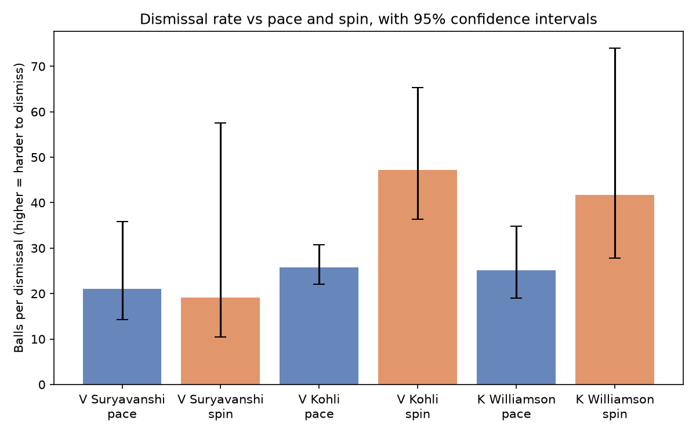
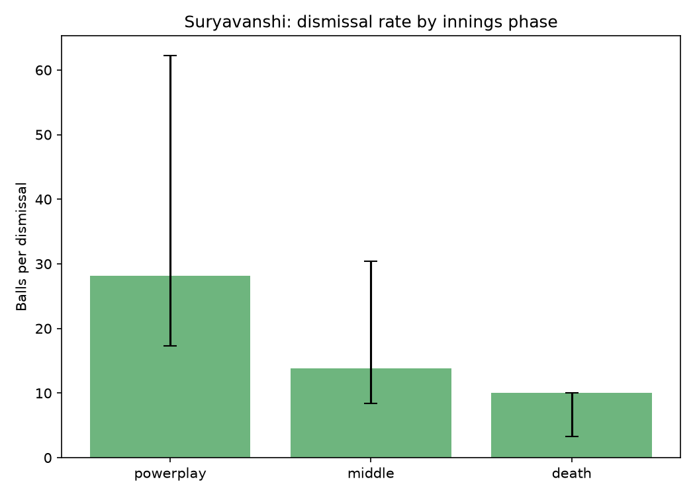

# Cricket Matchup Analysis

A pipeline that takes a batter's ball-by-ball IPL record and quantifies how
they perform against pace vs spin, and across phases of an innings — using
bootstrapped confidence intervals instead of raw point estimates, so small
samples don't get reported as if they were certainties.

Built and tested on two players at opposite ends of the sample-size
spectrum: Vaibhav Suryavanshi (23 IPL matches, 2025-2026) and Virat Kohli
(275 IPL matches, 2008-2026).

## Why this exists

Cricket commentary throws around claims like "struggles against spin" or
"vulnerable in the middle overs" without checking whether the underlying
sample actually supports them. This project tests those claims directly
against ball-by-ball data, and is explicit about which findings survive
scrutiny and which don't.

## Findings

**Suryavanshi's "weak against spin" narrative is not supported by the
data.** Balls-per-dismissal against pace (21.1) and spin (19.1) are close,
and their 95% confidence intervals overlap almost completely (14.3-35.8 vs
10.5-57.5). At 23 matches, there isn't enough data yet to make this claim
either way.

**Suryavanshi is more vulnerable in the middle overs than in the
powerplay.** 13.8 balls per dismissal in the middle overs vs 28.2 in the
powerplay, with confidence intervals that only barely overlap. This is a
more specific and better-supported finding than the spin narrative, and
fits a plausible tactical read: powerplay fielding restrictions let him
free-swing, middle overs is where set fields make him work for it.

**Kohli shows a clear, statistically separated advantage against spin.**
25.7 balls per dismissal against pace vs 47.2 against spin, with
non-overlapping 95% confidence intervals (22.0-30.8 vs 36.4-65.3), built on
135 and 47 dismissal events respectively. Unlike Suryavanshi's numbers,
this pattern held stable as bowler-style coverage improved from 30% to 80%
of his total sample, which is a good sign it reflects something real
rather than a labeling artifact.




## Method

- Ball-by-ball data from [Cricsheet](https://cricsheet.org), IPL 2008-2026
- Bowler style (arm, pace/spin) hand-mapped from public profiles, covering
  bowlers responsible for ~80%+ of each player's total deliveries faced by
  volume; the remaining long tail (individually under 30 balls each) is
  excluded and not counted toward any statistic
- Dismissal rates estimated via bootstrap resampling (10,000 resamples,
  95% CI from the 2.5th/97.5th percentiles) rather than reported as single
  point estimates
- Phase boundaries: powerplay (overs 1-6), middle (7-15), death (16-20)

## Repo structure

```
src/
  extract_deliveries.py   # pulls a player's deliveries from Cricsheet JSON
  build_matchup_table.py  # joins bowler style, adds innings phase
  bootstrap_analysis.py   # dismissal-rate CIs by bowl type
  phase_analysis.py       # dismissal-rate CIs by innings phase
  arm_analysis.py         # dismissal-rate CIs by arm + bowl type
  stats.py                # shared bootstrap logic
  make_charts.py          # generates the charts above
  bowler_lookup.csv       # bowler -> arm, bowl type
data/
  raw/          # Cricsheet source files (gitignored, see Setup)
  processed/    # cleaned, per-player CSVs
charts/         # generated PNGs
```

## Setup

```
python3 -m venv venv
source venv/bin/activate
pip install -r requirements.txt
```

Raw data isn't checked into this repo. To reproduce:

```
cd data/raw
curl -L -o ipl_json.zip https://cricsheet.org/downloads/ipl_json.zip
unzip ipl_json.zip -d ipl_json
curl -L -o people.csv https://cricsheet.org/register/people.csv
```

## Running it on a new player

```
python src/extract_deliveries.py --player-id <cricsheet_id> --name <short_name>
python src/build_matchup_table.py --name <short_name>
python src/bootstrap_analysis.py --name <short_name>
```

Find a player's Cricsheet ID with:

```
grep -i "<player name>" data/raw/people.csv
```

New bowlers faced will need adding to `src/bowler_lookup.csv` — the scripts
print a warning listing any unmapped bowler names rather than silently
dropping them.

## Limitations

- Cricsheet has no line/length/pitch data, so "weakness" here is scoped to
  bowler type (pace/spin, arm) and phase of innings only — not shot type or
  dismissal location
- Bowler style mapping is manual and incomplete by design (see Method); a
  small number of infrequent bowlers per player are excluded
- Suryavanshi's sample (23 matches) is genuinely small; several confidence
  intervals in this repo are wide enough that "no significant difference"
  is the honest conclusion, not a limitation of the method